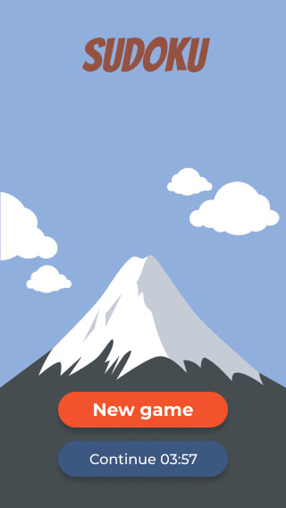
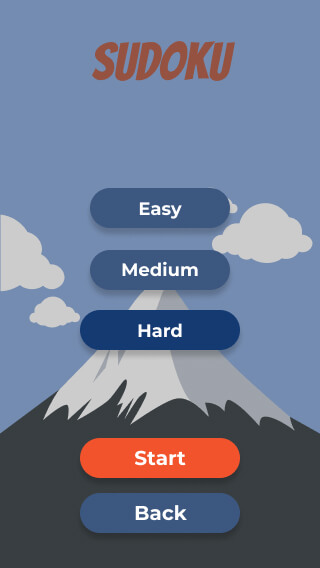
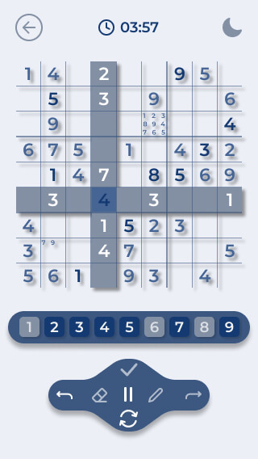
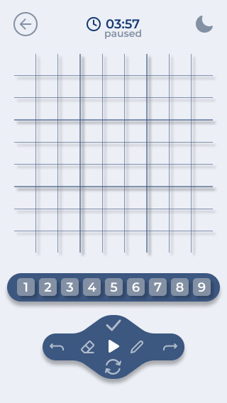
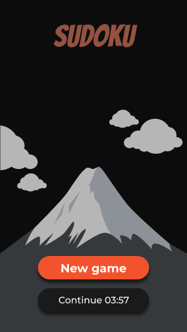
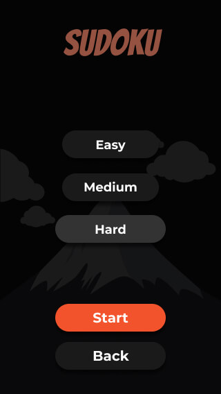
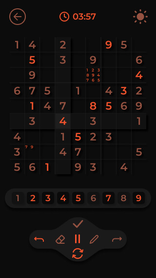
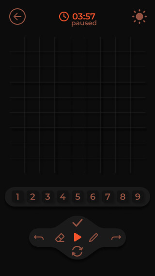

# Sudoku app design

( NOTE! project under continuous development - no live website to test it yet )

Mobile and desktop layouts for my [Sudoku App](https://github.com/bartekszajna/sudoku_app/) created with the use of [Figma](https://figma.com), free design&prototyping tool. Both versions exclusively built by me.

Along the process I was taking advantage of [dribbble](https://dribbble.com/) in order to find some inspirations and create moodboard to incorporate best ideas into my design.

## Mobile version light

  
  
  
  

## Mobile version dark

  
  
  
  

